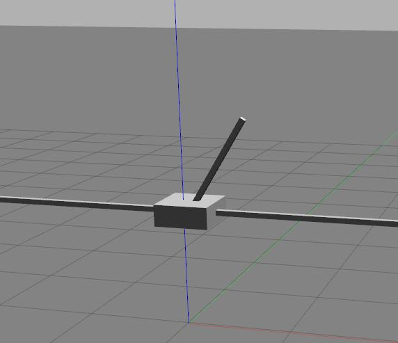
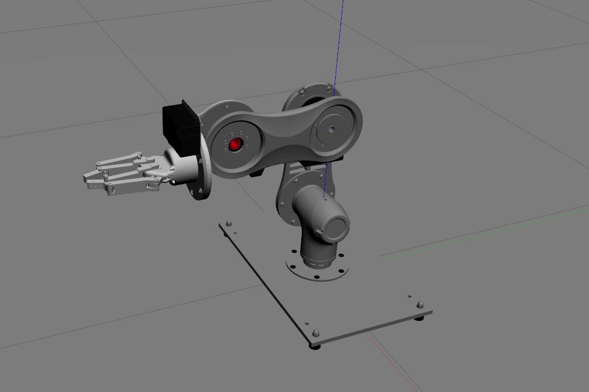
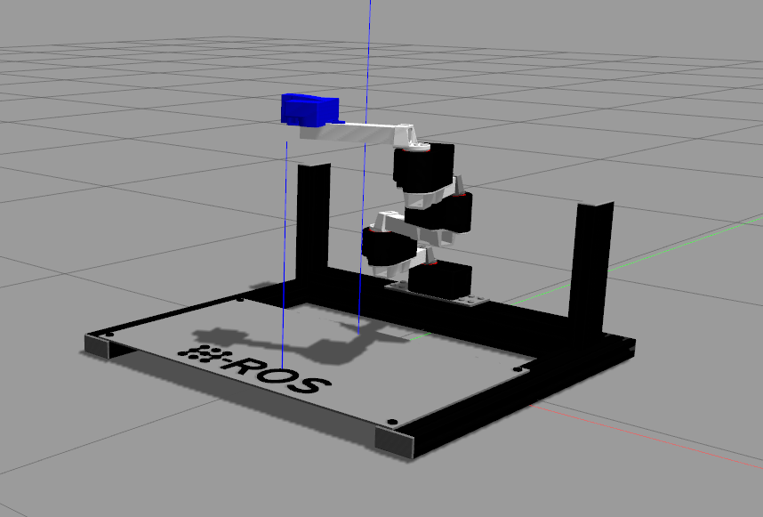
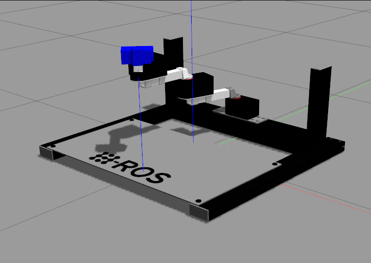
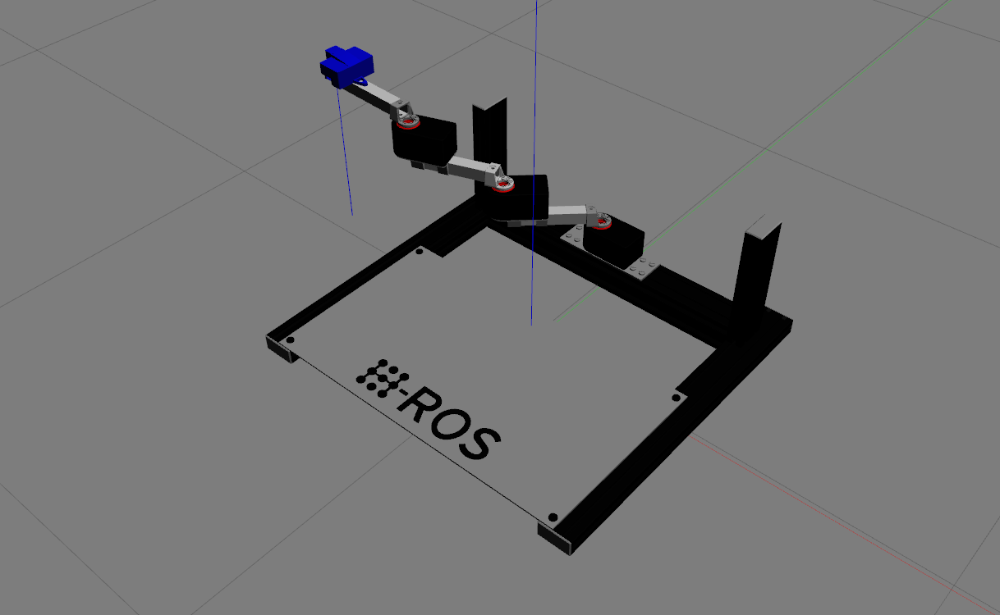
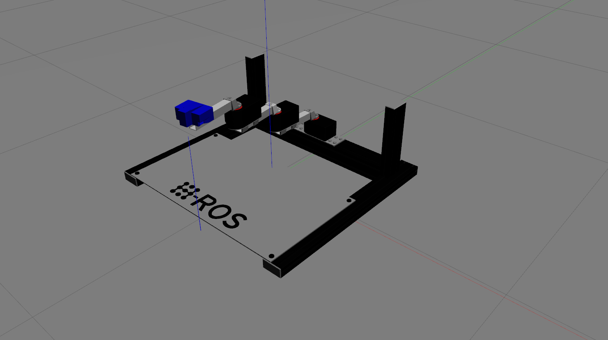
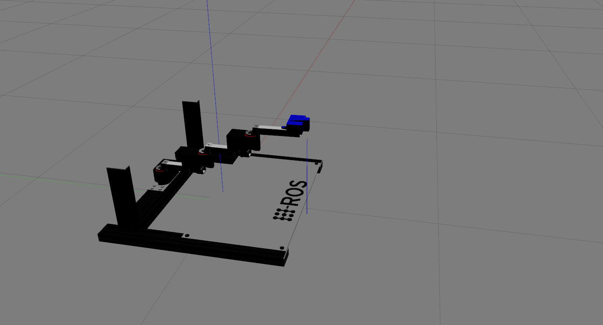
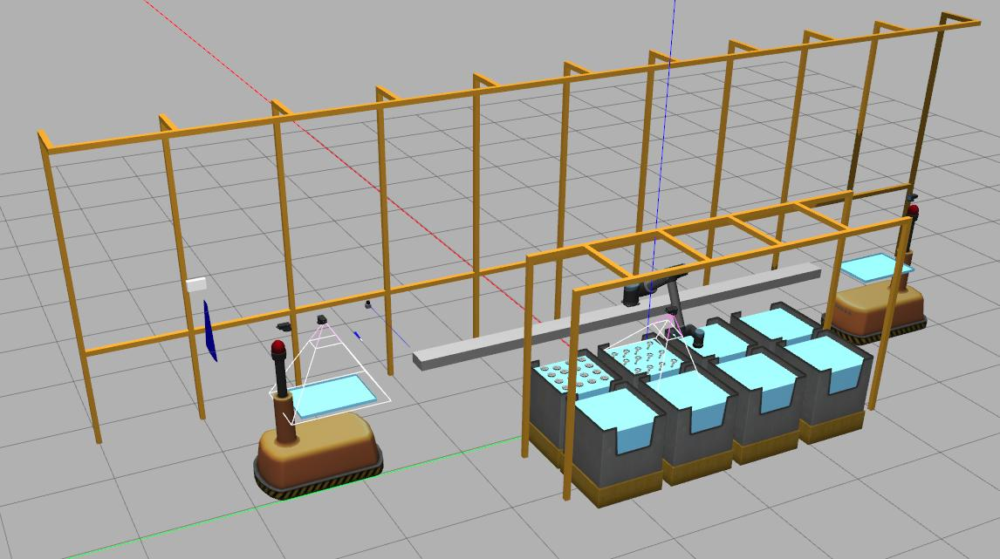

EN | [中文](https://github.com/zhaolongkzz/human_motion/blob/master/README_CN.md)

# Overview of gym-gazebo
An OpenAI gym extension for using Gazebo known as `gym-gazebo`!...

## Summary
Here I provide some installation and probblem solving, 


Here I provide the code for [CVPR2015 Structural-RNN](https://arxiv.org/pdf/1511.05298.pdf), the original code of author is [here](http://asheshjain.org/srnn/).

The work I have done is reproduce the paper, and make a animation from the result. And making a ROS topic to publish motion data,then a predicter to subscribe the data and predict the next motion from dataset. The code also get a TF animation in Rviz.

Qualitatively, ERD models human motion better than LSTM-3LR. However, in the short-term, it does not mimic the ground-truth as well as LSTM-3LR.

it well handles both short and long term forecasting. And the SRNN exhibit well both in short and long term prediction, the most important is that SRNN can also get well in aperiodic activity all algorithms.

### Main files Location:
- ./scripts/Prediction/generateMotionForecast.py
- ./scripts/Animation/motionAnimation.py

## Prerequisites
- ubuntu16.04
- anaconda3
  &ensp;&ensp;(install anaconda, click [here](http://docs.anaconda.com/anaconda/install/linux/).)
- ROS-Kinetic
  &ensp;&ensp;(you can go to the official web [here](http://wiki.ros.org/kinetic/Installation/Ubuntu).)
- python=2.7
  &ensp;&ensp;(with anaconda env below.)

you can create an environment to run them.

```bash
conda create -n srnn python=2.7
```

the package you need to install:
- numpy>=1.8.1
- theano=0.8.2
- matplotlib=2.2.3
- h5py=2.9.0

if you want to train it with GPU here, you should install cuda
- cuda=8.0
- libcudnn6_6.0.21

**Note:** that cuda9 is not suitable for the code, please reinstall cuda8 and cudnn6 instead.

with the theano, using the package [NeuralModels](https://github.com/asheshjain399/NeuralModels) same as the paper.
use the Model of theano, and install it with:
```python setup.py develop```

## Dataset
**Note:** you can download the mocap dataset from [here](http://www.cs.stanford.edu/people/ashesh/h3.6m.zip), and if you want more raw dataset, you can visit [H3.6m](http://vision.imar.ro/human3.6m/description.php).

And the Pre-trained dataset is in [here](https://drive.google.com/drive/folders/0B7lfjqylzqmMZlI3TUNUUEFQMXc).
(**Provided by the paper's author.**)

## Quickstart

first, here you can git the code from github:
```bash
git clone https://github.com/zhaolongkzz/human_motion
unzip human_motion
cd human_motion/scripts
wget http://www.cs.stanford.edu/people/ashesh/h3.6m.zip
unzip h3.6m.zip
rm h3.6m.zip
# download the Pre-trained dataset from Drive to scripts floder
```

**Note:**download the Pre-tarined dataset from google drive, and place them into the scripts floder.(the h3.6m and Pre-train floders is both in scripts floder.)


### With python
```bash
cd scripts
# train your model, it will cost you about 20 min
python Prediction/generateMotionForecast.py srnn smoking
# make a animation, and then it will play it automaticcally
python Animation/motionAnimation.py --model srnn --action smoking
# the result data will save with a h5df file in /Motion floder!
```

### With ROS

Play the animation of the motion!
```bash
cd human_motion/scripts
roscore
# predict the motion, remember to open another terminal
rosrun human_motion motion_predicts.py srnn smoking
# read the file and publish the msg
rosrun human_motion motion_publisher.py srnn smoking
# get the data, and play the animation
rosrun human_motion motion_animation.py
```

Here you can run the ground_truth or forcast file with RViz
```bash
rosrun human_motion read_motion.py h3.6m/dataset/S5/smoking_1.txt
rosrun human_motion rviz_motion.py motion:=/motion_skeleto
```

## Structure
The floder here is human\_motion.you'd better place the dataset as below.

<p align="center">
  <br><br>
</p>

S-RNN architecture from the factor graph representation of the st-graph. The factors in the st-graph operate in a temporal manner, where at each time step the factors observe (node & edge) features and perform some computation on those features. In S-RNN, we represent each factor with an RNN. We refer the RNNs obtained from the node factors as nodeRNNs and the RNNs obtained from the edge factors as edgeRNNs. The interactions represented by the st-graph are captured through connections between the nodeRNNs and the edgeRNNs.
**Parameter sharing and structured feature space**

Structural-RNN make a connection between nodes and edges, and every one is trained by RNNs, so from the temporal graph, it will relate before state and the skeleto, then get a trade-off action to predict in the future.

## Video
### srnn_smoking
<p align="center">
  <br><br>
</p>

### srnn_eating
<p align="center">
  <br><br>
</p>

### srnn_smoking in RViz
<p align="center">
  <br><br>
</p>

## LICENCE
[MIT License](https://github.com/zhaolongkzz/human_motion/blob/master/LICENSE)

## FAQ
**Q1**.the path is miss, and it will not run well?

**A1**:All the code is set by the premise of the scripts floder. So here you must change your dictionary to /scripts with your terminal, then it will get normal operation.


###############################3


<!--[](https://travis-ci.org/erlerobot/gym)-->

This work presents an extension of the initial OpenAI gym for robotics using ROS and Gazebo. A whitepaper about this work is available at https://arxiv.org/abs/1608.05742. Please use the following BibTex entry to cite our work:

```
@article{zamora2016extending,
  title={Extending the OpenAI Gym for robotics: a toolkit for reinforcement learning using ROS and Gazebo},
  author={Zamora, Iker and Lopez, Nestor Gonzalez and Vilches, Victor Mayoral and Cordero, Alejandro Hernandez},
  journal={arXiv preprint arXiv:1608.05742},
  year={2016}
}
```

-----

**`gym-gazebo` is a complex piece of software for roboticists that puts together simulation tools, robot middlewares (ROS, ROS 2), machine learning and reinforcement learning techniques. All together to create an environment whereto benchmark and develop behaviors with robots. Setting up `gym-gazebo` appropriately requires relevant familiarity with these tools.**

**Code is available "as it is" and currently it's not supported by any specific organization. Community support is available [here](https://github.com/erlerobot/gym-gazebo/issues). Pull requests and contributions are welcomed.**

-----

## Table of Contents
- [Environments](#community-maintained-environments)
- [Installation](#installation)
- [Usage](#usage)


## Community-maintained environments
The following are some of the gazebo environments maintained by the community using `gym-gazebo`. If you'd like to contribute and maintain an additional environment, submit a Pull Request with the corresponding addition.

| Name | Middleware | Description | Observation Space | Action Space | Reward range |
| ---- | ------ | ----------- | ----- | --------- | -------- |
| `GazeboCircuit2TurtlebotLidar-v0` | ROS | A simple circuit with straight tracks and 90 degree turns. Highly discretized LIDAR readings are used to train the Turtlebot. Scripts implementing **Q-learning** and **Sarsa** can be found in the _examples_ folder. | | | |
| `GazeboCircuitTurtlebotLidar-v0.png` | ROS | A more complex maze  with high contrast colors between the floor and the walls. Lidar is used as an input to train the robot for its navigation in the environment. | | | TBD |
| `GazeboMazeErleRoverLidar-v0` | ROS, [APM](https://github.com/erlerobot/ardupilot) | **Deprecated** | | | |
| `GazeboErleCopterHover-v0` | ROS, [APM](https://github.com/erlerobot/ardupilot) | **Deprecated** | | | |

## Other environments (no support provided for these environments)

The following table compiles a number of other environments that **do not have
community support**.

| Name | Middleware | Description | Observation Space | Action Space | Reward range |
| ---- | ------ | ----------- | ----- | --------- | -------- |
| `GazeboCartPole-v0` | ROS | | Discrete(4,) | Discrete(2,) | 1) Pole Angle is more than ±12° 2)Cart Position is more than ±2.4 (center of the cart reaches the edge of the display) 3) Episode length is greater than 200 |
| `GazeboModularArticulatedArm4DOF-v1` | ROS | This environment present a modular articulated arm robot with a two finger gripper at its end pointing towards the workspace of the robot.| Box(10,) | Box(3,) | (-1, 1) [`if rmse<5 mm 1 - rmse else reward=-rmse`]|
| `GazeboModularScara4DOF-v3` | ROS | This environment present a modular SCARA robot with a range finder at its end pointing towards the workspace of the robot. The goal of this environment is defined to reach the center of the "O" from the "H-ROS" logo within the workspace. This environment compared to `GazeboModularScara3DOF-v2` is not pausing the Gazebo simulation and is tested in algorithms that solve continuous action space (PPO1 and ACKTR from baselines).This environment uses `slowness=1` and matches the delay between actions/observations to this value (slowness). In other words, actions are taken at "1/slowness" rate.| Box(10,) | Box(3,) | (-1, 1) [`if rmse<5 mm 1 - rmse else reward=-rmse`]|
| `GazeboModularScara3DOF-v3` | ROS | This environment present a modular SCARA robot with a range finder at its end pointing towards the workspace of the robot. The goal of this environment is defined to reach the center of the "O" from the "H-ROS" logo within the workspace. This environment compared to `GazeboModularScara3DOF-v2` is not pausing the Gazebo simulation and is tested in algorithms that solve continuous action space (PPO1 and ACKTR from baselines).This environment uses `slowness=1` and matches the delay between actions/observations to this value (slowness). In other words, actions are taken at "1/slowness" rate.| Box(9,) | Box(3,) | (-1, 1) [`if rmse<5 mm 1 - rmse else reward=-rmse`]|
| `GazeboModularScara3DOF-v2` | ROS | This environment present a modular SCARA robot with a range finder at its end pointing towards the workspace of the robot. The goal of this environment is defined to reach the center of the "O" from the "H-ROS" logo within the workspace. Reset function is implemented in a way that gives the robot 1 second to reach the "initial position".| Box(9,) | Box(3,) | (0, 1) [1 - rmse] |
| `GazeboModularScara3DOF-v1` | ROS | **Deprecated** | | | TBD |
| `GazeboModularScara3DOF-v0` | ROS | **Deprecated** | | | | TBD |
| `ARIACPick-v0` | ROS | | | |  |

## Installation
Refer to [INSTALL.md](INSTALL.md)

## Usage

### Build and install gym-gazebo

In the root directory of the repository:

```bash
sudo pip install -e .
```

### Running an environment

- Load the environment variables corresponding to the robot you want to launch. E.g. to load the Turtlebot:

```bash
cd gym_gazebo/envs/installation
bash turtlebot_setup.bash
```

Note: all the setup scripts are available in `gym_gazebo/envs/installation`

- Run any of the examples available in `examples/`. E.g.:

```bash
cd examples/turtlebot
python circuit2_turtlebot_lidar_qlearn.py
```

### Display the simulation

To see what's going on in Gazebo during a simulation, run gazebo client. In order to launch the `gzclient` and be able to connect it to the running `gzserver`:
1. Open a new terminal.
2. Source the corresponding setup script, which will update the _GAZEBO_MODEL_PATH_ variable: e.g. `source setup_turtlebot.bash`
3. Export the _GAZEBO_MASTER_URI_, provided by the [gazebo_env](https://github.com/erlerobot/gym-gazebo/blob/7c63c16532f0d8b9acf73663ba7a53f248021453/gym_gazebo/envs/gazebo_env.py#L33). You will see that variable printed at the beginning of every script execution. e.g. `export GAZEBO_MASTER_URI=http://localhost:13853`

**Note**: This instructions are needed now since `gazebo_env` creates a random port for the GAZEBO_MASTER_URI, which allows to run multiple instances of the simulation at the same time. You can remove the following two lines from the environment if you are not planning to launch multiple instances:

```bash
os.environ["ROS_MASTER_URI"] = "http://localhost:"+self.port
os.environ["GAZEBO_MASTER_URI"] = "http://localhost:"+self.port_gazebo
```

Finally, launch gzclient.
```bash
gzclient

```

### Display reward plot

Display a graph showing the current reward history by running the following script:

```bash
cd examples/utilities
python display_plot.py
```

HINT: use `--help` flag for more options.

### Killing background processes

Sometimes, after ending or killing the simulation `gzserver` and `rosmaster` stay on the background, make sure you end them before starting new tests.

We recommend creating an alias to kill those processes.

```bash
echo "alias killgazebogym='killall -9 rosout roslaunch rosmaster gzserver nodelet robot_state_publisher gzclient'" >> ~/.bashrc
```
